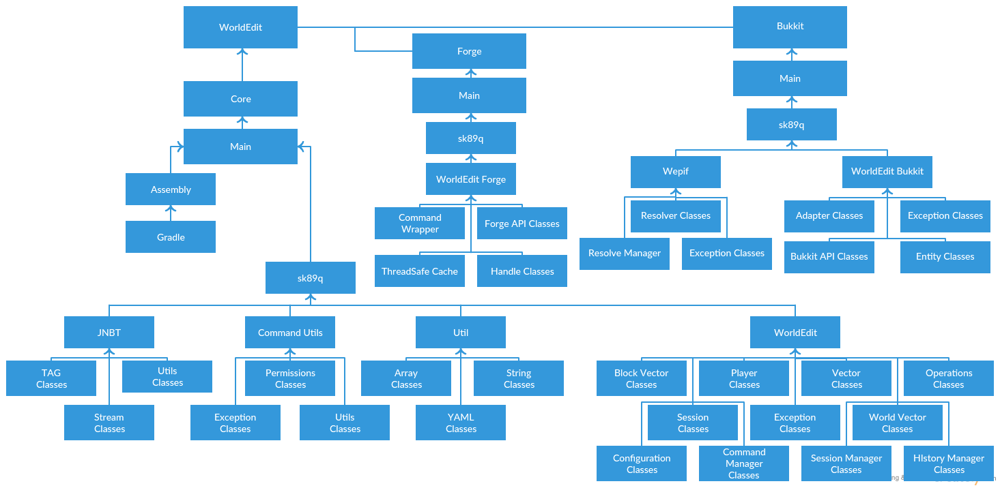
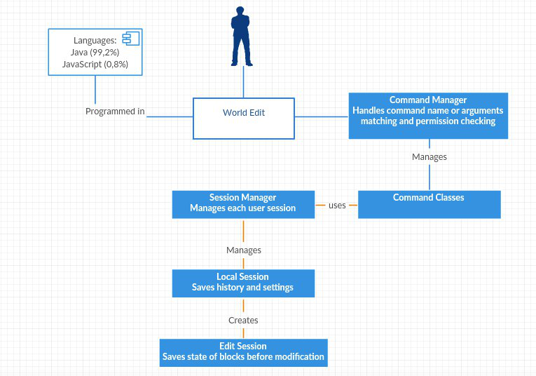
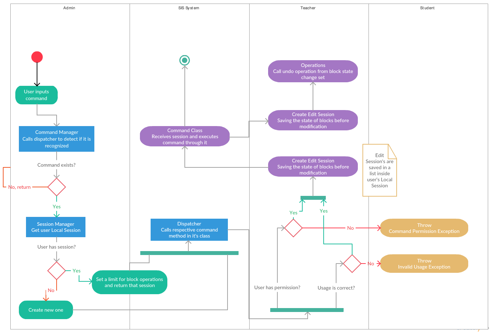
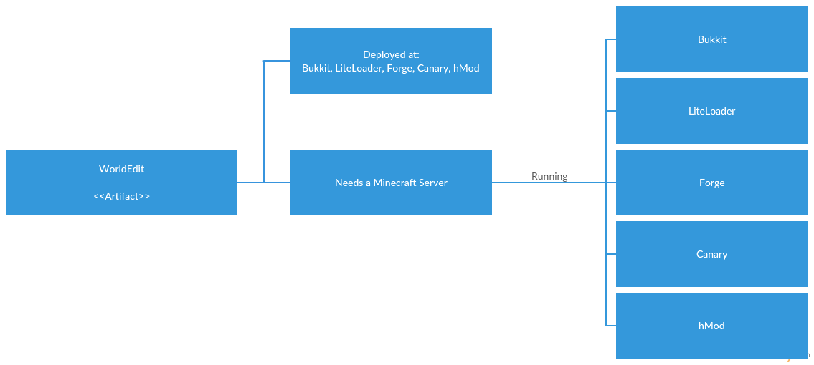
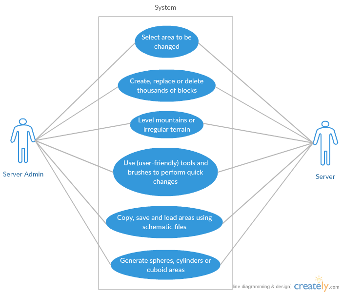

# Architecture

This is the core part of our documentation. We aim to demystify the big tree of packages this project consists on. Expand the software and provide other developers, the required knowledge to be aware of the pillars it holds.

In the following diagrams we tried to only represent the important classes or packages grouped among all the project as this is a very complex software. A full class diagram wouldn't be user-friendly, so we created a views joining all important related classes aiming to make it easier to understand and explain what's happening.

## Logical View

In sum, this project has three big packages (or Schemas):

- [WorldEdit-Core](https://github.com/joaolrpaulo/WorldEdit/tree/introduction/worldedit-core), this is the main project. It’s independent from any adapter.
- [WorldEdit-Bukkit](https://github.com/joaolrpaulo/WorldEdit/tree/introduction/worldedit-bukkit), the adapter redirected to the Bukkit platform
- [WorldEdit-Forge](https://github.com/joaolrpaulo/WorldEdit/tree/introduction/worldedit-forge), the adapter redirected to the Forge platform

As for these last two, they are required to support WorldEdit on Minecraft through other platforms, responsible for loading all the required plugins and create the functional environment. All the classes that we didn't represent here, are the ones that we don't consider as fundamental for the analysis.

### Command Manager

WorldEdit's way of managing commands is very sagaciously organized. From our study and previous knowledge with Bukkit, we found out this command architecture is also featured in other author's plugins. One of the main reasons is the simplicity of organizing all the required commands without having them all in a class with a massive amount of if statements.

It consists in having a manager for commands (Command Manager Class) which will map each command string or alias with corresponding method. The manager can register any command class, and will fetch method annotations like the example below:

```java
        @Command(
          aliases = { "/line" },
          usage = "[block] [thickness]",
          desc = "Draws a line segment between cuboid selection corners",
          help = "Help will be described here",
          flags = "h",
          min = 1,
          max = 2
        )
        
        @CommandPermissions("worldedit.region.line")
        @Logging(REGION)
        public void line(arguments) {
          // Command method will describe here
        }
      
```

Command Manager will register alias "/line" with method "line(args)". Next time the user inputs a command, manager will (call a dispatcher to) find which stored method is related to the input (methods that are mapped with their aliases in a data structure):

```java
        MappedCommands<String, Method> contains

        <"line", public void line(arguments)>
```

This architecture is extremely useful to avoid code polution and keep different commands separated per class or category.

### Local Session

Local Session saves history from every command made by an user, and helps us to know on-the-fly configurations from him. However, sessions are per user but not user bounded.

Local Session is the object that contains our clipboard, a set of configurations, brushes/masks, position 1/2 locations and Edit Session history.

### Edit Session

Every time we make an operation, World Edit creates an Edit Session with the set of blocks we changed. This type of session is saved as a list inside Local Session. If a user wants to undo, or redo, local session has all the history saved as a list of Edit Session objects. So, we can easy go back in our history.

It's inside the Edit Session we find the main methods for world operations like:

```
editSession.replaceBlocks()
editSession.setBlocks()
```
We can have a better overview at the full diagram of this view:



## Development View

The WorldEdit is a modular tool composed by a main package, free of dependencies, and by adapters that create bounds to the plugin.

Bukkit is the adapter that supports plugin connection to the game-server itself and implementing classes related to, wide range of blocks, entities and biomes. There is also a library with useful tools for Bukkit commands and classes that provide an internal permissions system to WorldEdit.

Core is the main package of the project. As mentioned previously, it works without dependencies, meaning it's where adapters fit. Inside the core there are several sub-packages, such as "command-related" packages that implement the control commands (CommandManager).

Forge is composed by all classes that make up the main component. In addition there's a "GUI" package, whose function is to handle the graphical user interface in Minecraft client associated with the adapter.



## Process View

In this process view, we decided to feature one of the most important diagrams, Activity.

When the user first inputs a command, the Command Manager is responsible for implementing a method for command detection. The command manager has a dispatcher which stores the command with respective method. After efficiently checking if the command exists it proceedes to call the session manager and fetch the user session.

#### Does the user session exists?

If session manager doesn't have any entry for that user, we will create one and return to the command manager. Otherwise, the already created session will be returned.

#### Back to the command Manager

Command manager will now call the dispatcher to run the method associated to the input command.

#### User has permission? Usage is correct?

If not exceptions will be returned, caught to deliver a specific messaged associated to the error.

If no exceptions are returned, an Edit Session can now be created, this will save all our modifications for later undo/redo case. The command class will then receive the session and execute the commands through it ([more about how this happens](#logical-view)).



## Physical View

This diagram represent where the artifacts go after being succesfully compiled and archived. After artifacts are ready, they are uploaded to multiples websites or communities, and then users can download them, and upload the correct version to their own server or client.



## Scenarios


