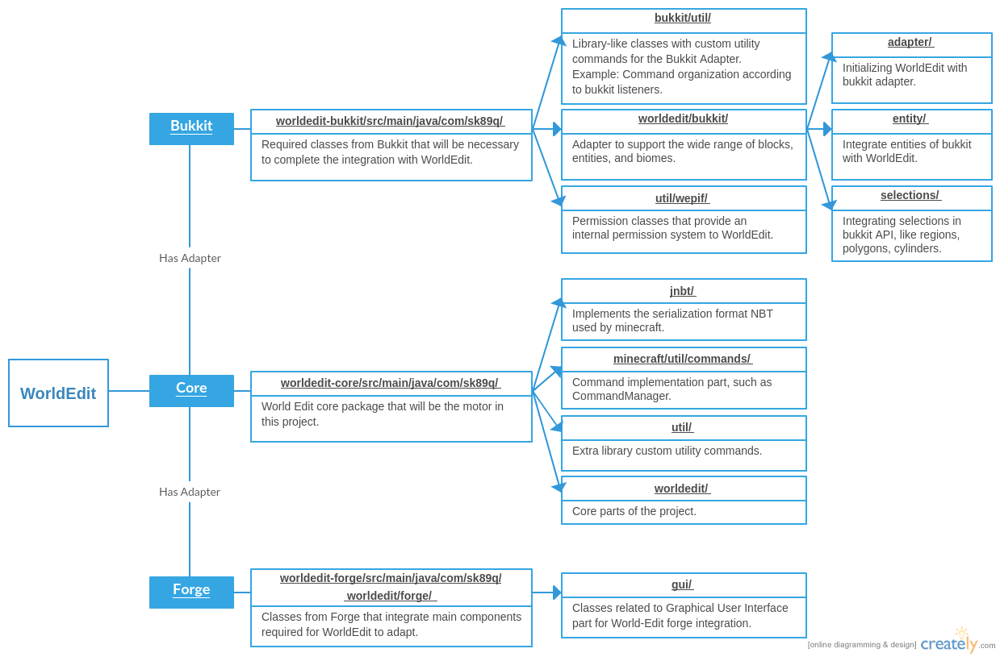
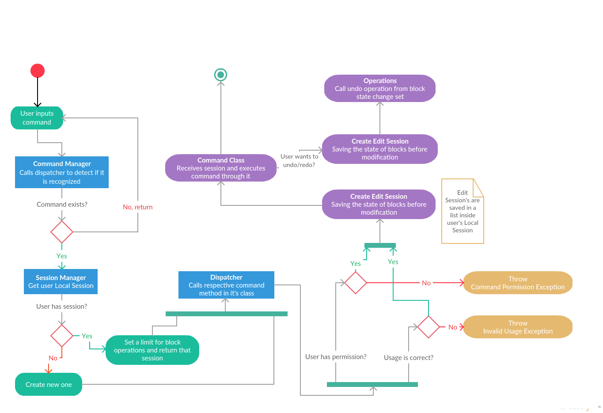

# Architecture

## Logical View

At this diagram we tried to only represent the important classes among all the project as this is a huge project, the full class diagram wouldn't be user-friendly. 
We tried to put all important related classes at a bucket so it will be more easy to look at and explain whats happeninng.

Basically this project has three big packages (or Schemas):

- [WorldEdit-Core](https://github.com/joaolrpaulo/WorldEdit/tree/introduction/worldedit-core), this is the main project. It’s independent from any adapter.
- [WorldEdit-Bukkit](https://github.com/joaolrpaulo/WorldEdit/tree/introduction/worldedit-bukkit), the adapter redirected to the Bukkit platform
- [WorldEdit-Forge](https://github.com/joaolrpaulo/WorldEdit/tree/introduction/worldedit-forge), the adapter redirected to the Forge platform

As for these last two, they are needed to support multiple plugins on Minecraft, responsible for loading all the required plugins and create the server-type environment. All the classes that we didn't represent here, are the ones that we didn't consider as fundamental for the analysis.

## Development View

## Process View

## Physical View

This diagram represent where the artifacts go after being succesfully compiled and archived. At a first step after artifacts are ready, they are uploaded to multiples websites, and then users can download them, and upload the correct version to their own server.

## Scenarios

