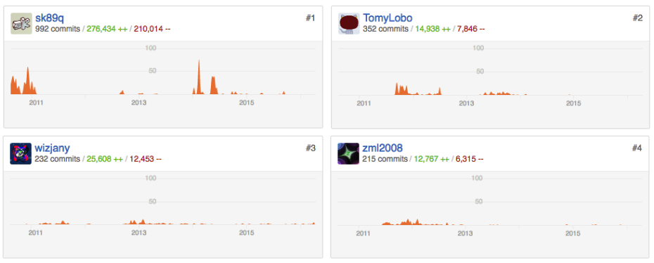

# Warning! [use this instead](https://joaolrpaulo.github.io/WorldEdit)

You can find each user contribution (who did what) in a file called [DIVISION.md](https://github.com/joaolrpaulo/WorldEdit/blob/introduction/documentation/DIVISION.md)

This branch will contain all the base of our work. 
For organization purposes, the content found here will be moved to the branch **gh-pages**, as HTML. Each file here will be a section on gh-pages.

Please do not use this version for evaluation, [use this instead](https://joaolrpaulo.github.io/WorldEdit), it's much more organized (website).


=========

# Introduction

This project is for a college subject (Software Arquitecture), and we want achieve
some goals like:

* [4+1 Architectural view model](https://en.wikipedia.org/wiki/4%2B1_architectural_view_model)
  * [Logical view]()
  * [Development view]()
  * [Process view]()
  * [Physical view]()
  * [Scenarios]()
 
Our introduction chapter, will be divided under two sub-sections, an user and developer introductory view:

##User View

###[WorldEdit? What it is?](http://wiki.sk89q.com/wiki/WorldEdit)

WorldEdit is a world editor for Minecraft which makes users life way more easy by helping on some essentials things in
game, like building structures, spawning objects, and manipulate them, among others. In this analysis we will talk about how this in-game framework works, and how it is implemented "behind the hood". It holds some interesting features:

* Select a region of a map (like pinpoint two positions in map)
* Fix map problems, such as broken water, missing snow, broken walls and much more!
* Make big constructions with two clicks
* Change blocks from one type to another, like from grass to diamond
* Create objects with one click, e.g, trees, spheres, animals

We aim to include different architectural views (more exactly, 4+1 Architecture view),and his stakeholders. During this analysis, we pretend to discuss about how we could improved this framework, contributing to the software and future developers.

##Developer View

In terms of developer view, and avoiding to spoil any conclusions, we want to get into some aspects of Minecraft itself.

Minecraft was made in Java, and it's world is composed by chunks. Chunks are 16x16x256 segments, and they are generated around players when they first enter the world. As they walk around, chunks are generated as needed. They can also be forced to load into memory by world management tools, such as World Edit.

Our architecture views along this documentation, will describe how the main components communicate with each other. Starting on the logical view up until the physical view, we can get really deeper into the structure of the project.

* In the logical view, we will feature a class diagram with a description of some of the main classes or packages.
* By the development view, a full described package diagram with the programmers perspective.
* The process view will walk us by the activity diagram and behaviour.
* In the physical view, the system from a system engineer's point of view. Deployment diagram will feature the topology of software components different from the last views.
* The last view, show us some use-cases of WorldEdit.

# Features

We will omit most command syntax. However, a detailed overview of all commands can be found in the [official documentation](http://wiki.sk89q.com/wiki/WorldEdit).

## Region Operations

It's possible to perform a long range of region operations with World Edit.

To perform those kind of operations, the user is required to select a Cuboid area. This is done by selecting two points which will create a rectangular selection (other shapes and formats can also be used).

Using the selected area, we can perform changes like:

* Setting Blocks
* Replacing Blocks (example below)
* Create walls
* Place overlays over a range of blocks
* Stacking (example below)
* Move a set of blocks
* Smooth an area, for example, a rough mountain
* Naturalize, make an area look more natural with grass and dirt
* Placing flora, scatter tall grass and flowers for grass or cactus for sand
* Deform regions, applying a user defined equation

**Region Selection**
```
Usage: //wand [Gives user an item that can be used to flag first position (left click) and second position (right click)]
Usage: //pos1 or //pos2 [Selects first and second positions]
```


### Setting/Replacing Blocks
`//replace [list-of-blocks-to-replace] [block-to-replace-with]`


### Stacking
`//stack [count] [direction]`


## Clipboard

WorldEdit provides the ability to have a clipboard that allows users to copy, paste and even save an area. These cuboid areas can be saved into a file (*schematic files*) under a storage at `\plugins\WorldEdit\schematics\` and loaded at any time with a simple command. The copy-paste functionality saves the cuboid area in cache, in the user Local Session until we decide to paste it.

Some examples of clipboard operations are:

### Copy/Paste Areas
`//copy //paste [-aso]`


### Schematics
`//schematic|schem save|load [format] [filename]`


## Generation

Generation tools provide us the ability to create a set of shapes (can be generated with mathematics) up to a full forest.

This section is focused in creating architectural elements, like for example a sphere or a pyramid. WorldEdit is also able to generate a forest like `/forestgen 10`:

> The command searches the area around you, controlled by the size parameter, and it will descend in elevation a bit in order to find grass or dirt (trees will only be generated on top of those two blocks), but it will not ever go up above your feet.

The generation algorithm was made clever to develop a forest according to surrounding area conditions. However, it is not possible to get 100% density (a tree in every spot) as Notch's (creator of Minecraft) tree algorithm won't permit that.

### Generate a sphere/ellipsoid
`//hsphere [block] [radius],[radius],[radius] [raised?]`


### Forest Generation
`//forestgen [size] [type] [density]`


## Utility

If we saw a lot of interesting features, it doesn't end here! Utility joins a lot of useful functions we often manually struggle for. In sum, we want to distinguish tools like:

* Draining liquids
* Filling pits
* Removing annoying mobs
* Extinguish fire
* Brushes: build from far away
* 
One of the most interesting ones is the brushes. As the name says, we cannot only paint with it but we can also generate blocks or shapes to where we are pointing to (terraforming). It also allows us to smooth rough mountains and level terrains.

### Generate spheres with a click
`//brush sphere [-h] [block] [radius]`


### Smooth an area
`//brush smooth [-n] [size] [iterations]`


# Stakeholders

WorldEdit is made of a large necessity from the community all around the world running vanilla minecraft or Bukkit/Forge servers.
The project runs on a voluntary base and is featured in a large community of plugins called [Bukkit](https://www.bukkit.org).

It's almost impossible for the community to imagine world or block management without WorldEdit, we can conclude this by the large amount
of users depending on it `13,963,291 downloads on 28/05/2016`.


Figure 1 - An example of a complex architecture very hard to implement manually.

## Developers

WorldEdit has a large base of community contributors. We've grouped the main motors of this project below. The 4 authors below are classified as Authors and have the most commits and activity in the active development process of the software.


Figure 2 - Contributors of the project from the github page

## Users

This stakeholder is made by a group of users that are part of communities like, [Bukkit](http://dev.bukkit.org) and [Forge](http://files.minecraftforge.net/). 
These last two, are the important part that create the bounds between minecraft and plugin loading. Both create the required environment to load mods/plugins into the client.
In our case, WorldEdit makes world management easy, like plug & play. It’s also [part of the Bukkit community](http://dev.bukkit.org/bukkit-plugins/worldedit/), along with lots of other plugins.
WorldEdit, however, implements a clever project structure that molds into being multi-platform using adapters.

The users from communities like Bukkit or Forge, are the important part here, who need this plugin and contribute to it daily, by suggesting new features or helping to fix problems.

# Architecture

This is the core part of our documentation. We aim to demystify the big tree of packages this project consists on. Expand the software and provide other developers, the required knowledge to be aware of the pillars it holds.

In the following diagrams we tried to only represent the important classes or packages grouped among all the project as this is a very complex software. A full class diagram wouldn't be user-friendly, so we created a views joining all important related classes aiming to make it easier to understand and explain what's happening.

## Logical View

In sum, this project has three big packages (or Schemas):

- [WorldEdit-Core](https://github.com/joaolrpaulo/WorldEdit/tree/introduction/worldedit-core), this is the main project. It’s independent from any adapter.
- [WorldEdit-Bukkit](https://github.com/joaolrpaulo/WorldEdit/tree/introduction/worldedit-bukkit), the adapter redirected to the Bukkit platform
- [WorldEdit-Forge](https://github.com/joaolrpaulo/WorldEdit/tree/introduction/worldedit-forge), the adapter redirected to the Forge platform

As for these last two, they are required to support WorldEdit on Minecraft through other platforms, responsible for loading all the required plugins and create the functional environment. All the classes that we didn't represent here, are the ones that we don't consider as fundamental for the analysis.

### Command Manager

WorldEdit's way of managing commands is very sagaciously organized. From our study and previous knowledge with Bukkit, we found out this command architecture is also featured in other author's plugins. One of the main reasons is the simplicity of organizing all the required commands without having them all in a class with a massive amount of if statements.

It consists in having a manager for commands (Command Manager Class) which will map each command string or alias with corresponding method. The manager can register any command class, and will fetch method annotations like the example below:

```java
        @Command(
          aliases = { "/line" },
          usage = "[block] [thickness]",
          desc = "Draws a line segment between cuboid selection corners",
          help = "Help will be described here",
          flags = "h",
          min = 1,
          max = 2
        )
        
        @CommandPermissions("worldedit.region.line")
        @Logging(REGION)
        public void line(arguments) {
          // Command method will describe here
        }
      
```

Command Manager will register alias "/line" with method "line(args)". Next time the user inputs a command, manager will (call a dispatcher to) find which stored method is related to the input (methods that are mapped with their aliases in a data structure):

```java
        MappedCommands<String, Method> contains

        <"line", public void line(arguments)>
```

This architecture is extremely useful to avoid code pollution and keep different commands separated per class or category.

### Local Session

Local Session saves history from every command made by an user, and helps us to know on-the-fly configurations from him. However, sessions are per user but not user bounded.

Local Session is the object that contains our clipboard, a set of configurations, brushes/masks, position 1/2 locations and Edit Session history.

### Edit Session

Every time we make an operation, World Edit creates an Edit Session with the set of blocks we changed. This type of session is saved as a list inside Local Session. If a user wants to undo, or redo, local session has all the history saved as a list of Edit Session objects. So, we can easy go back in our history.

It's inside the Edit Session we find the main methods for world operations like:

```
editSession.replaceBlocks()
editSession.setBlocks()
```
We can have a better overview at the full diagram of this view:


## Development View

The WorldEdit is a modular tool composed by a main package, free of dependencies, and by adapters that create bounds to the plugin.

Bukkit is the adapter that supports plugin connection to the game-server itself and implementing classes related to, wide range of blocks, entities and biomes. There is also a library with useful tools for Bukkit commands and classes that provide an internal permissions system to WorldEdit.

Core is the main package of the project. As mentioned previously, it works without dependencies, meaning it's where adapters fit. Inside the core there are several sub-packages, such as "command-related" packages that implement the control commands (CommandManager).

Forge is composed by all classes that make up the main component. In addition there's a "GUI" package, whose function is to handle the graphical user interface in Minecraft client associated with the adapter.


## Process View

In this process view, we decided to feature one of the most important diagrams, Activity.

When the user first inputs a command, the Command Manager is responsible for implementing a method for command detection. The command manager has a dispatcher which stores the command with respective method. After efficiently checking if the command exists it procedes to call the session manager and fetch the user session.

#### Does the user session exists?

If session manager doesn't have any entry for that user, we will create one and return to the command manager. Otherwise, the already created session will be returned.

#### Back to the command Manager

Command manager will now call the dispatcher to run the method associated to the input command.

#### User has permission? Usage is correct?

If not exceptions will be returned, caught to deliver a specific messaged associated to the error.

If no exceptions are returned, an Edit Session can now be created, this will save all our modifications for later undo/redo case. The command class will then receive the session and execute the commands through it ([more about how this happens](#logical-view)).


## Physical View

This diagram represent where the artifacts go after being successfully compiled and archived. After artifacts are ready, they are uploaded to multiples websites or communities, and then users can download them, and upload the correct version to their own server or client.


## Scenarios


# Storage

## YAML
YAML is a encoding format that makes data more readable by human beings, it was inspired in languages such as XML, Python, Perl, and Internet Message Protocol. It was created by Clark Evans, Brian Ingerson and Oren Ben-Kiki, by the year of 2000.

YAML (pronounced as "yammel"), was designed with a very proper idea, that every data could be represented by a set of list, hashes, and simple values.
YAML only uses unicode characters (UTF-8 and UTF-16)

YAML is relatively simple to use. The respective file holds the information in a indented format like the example below:

```
	Blocks:
 	- Grass
 	- Sand
 	- Stone

	Users:
 	  Pedro: '- Developer'
 	  Marco: '* Second Developer'
 	  João: '# Developer'
 	  Andreia: '\ Developer'
```

Within the domain of the Java language, YAML fields can be easily accessed using:

```java
	yamlFile.getStringList("Blocks");
	// Will return a list ['Grass', 'Sand', 'Stone']
```

```java
	yamlFile.getConfigurationSection('Users').getKeys(false)
	// Will return ['Pedro', 'Marco', 'Joao', 'Andreia']
	// We can now do:
	
	yamlFile.getString("Users.Pedro");
	// Will return '- Developer'
	
```

In the context of the project that we have been reviewing during this semester, YAML is used to store some configurations related to multiple aspects such as:
* User data
* World data 
* Blocks data 
* Command restrictions
* Zone restrictions, among others.

An more particular example can be found at [config.yml](https://github.com/sk89q/WorldEdit/blob/master/worldedit-bukkit/src/main/resources/defaults/config.yml)

# Contributing

WorldEdit is open to community contributions. It's also useful if you need to create an adapter for your software. However, your code must be efficient and tested.

Before cloning the project and start writing code, remember the checklist:

* Have all tabs been replaced into four spaces? Are indentations 4-space wide?
* Have I written proper Javadocs for my public methods? Are the @param and @return fields actually filled out?
* Have I git rebased my pull request to the latest commit of the target branch?
* Have I combined my commits into a reasonably small number (if not one) commit using git rebase?
* Have I made my pull request too large? Pull requests should introduce small sets of changes at a time. Major changes should be discussed with the team prior to starting work.
* Are my commit messages descriptive?

## Branching Model

If you are not used to git, make sure to also be aware of their branching model.

To avoid consecutive merges, commit disorganization and code loss, WorldEdit follows successful branch model as the figure below.

The develop branch (integration) is the core part where developers are working. Every time a developer needs to create a new feature, they open a new branch, for example `feature/replaceblocks`. After the new feature has been completed, that branch can now be merged back to develop.

Release branches support preparation of a new production release. They allow for last-minute dotting of i’s and crossing t’s. When we finish a release branch, we merge it to master. The changes made on the release branch also need to be merged back into develop, so that future releases also contain these bug fixes.

Hotfix branches are required for critical bugfixes. When completed they need to be merged back into master and develop must also receive those changes.

This is sucessfull git production!


## Compiling

The build process uses Gradle, which isn't required to download.

Navigate to WorldEdit folder
`./gradlew clean setupDecompWorkspace`
`./gradlew build`


After that you will find:

* The core of WorldEdit in `worldedit-core/build/libs`
* Bukkit adapter in `worldedit-bukkit/build/libs`
* Forge adapter in `worldedit-forge/build/libs`


# Improving World Edit

### The problem

Minecraft, more specific, the Bukkit Adapter has known limitations related to asynchronous world modification. 
If we try to run block modifications in a separate thread we will get an exception like:

> [Timer-51/WARN]: java.lang.IllegalStateException: Asynchronous block remove!

Derived from this, World Edit core runs every task using the main thread. This decision can cause complications when performing tasks with a massive number of blocks.
As for example, if we try to paste a schematic with 1 million blocks running World Edit in a server with the following specifications:

> Intel Xeon E3 1225v2 3.2 GHz+

> 4GB of RAM allocated to the server

The server will stop responding after a few seconds, possibly causing world chunk errors.

### The solution

After studying the problem, it's possible to understand we can achieve an asynchronous operation and still avoid to use a separate thread.
We can do this by scheduling the number of blocks per a unit of time.

Let's take again our example of 1 million blocks. 
If we define a static constant of **5000 blocks per each second**, we can schedule consecutive tasks and complete our task in about 3.33 minutes.

* Task #1
  * Modify 5000 blocks
  * Run now

* Task #2
  * Modify 5000 blocks
  * Run after 1 second
  
* Task #3
  * Modify 5000 blocks
  * Run after 2 seconds
  
After 200 tasks, we will complete our job. This method will give us the ability to see the progress of our operation and avoid any world/chunk
errors if the server gets shutdown. The job can be saved to the disk and sustained any time.

#Conclusion
###### What did we learn?

WorldEdit is a very complex project. We enriched a lot of our knowledge about organized software architecture by getting deeper into this project. It leaves us surprised studying such clever code organization where most of the times people tend to find fixes.

In the logical and development architectures, more specifically, the managers and adapters, we were able to learn a new diverse way of how to create multi-platform compatible software using adapters. Along with that, we saw new ideas to centralize complex command classes, like the Command Manager does.

We, programmers, are used to, in our world, start something from **scratch**. We have to make lots of **choices** while building software, some of them may not be the best if we are not used to the **environment we are programming in**. Most of the times we end up having to create a "recode" version of our project because we find out we can have a **better architecture** than what we started in. How many times this ~~doesn't~~ happen?

In the real word, an architect cannot fail on this aspects. It can lead to a disaster and lots of repercussions.

Programmers are always able to mold their project. But the moral in all this is that we can **greatly improve our workflow** and save a lot of time if we make it right on our base software architecture. Having a **solid architecture is the key to have a strong organized software**.

> Although software has no mass, it does have weight, weight that can ossify any system by creating inertia to change and introducing crushing complexity.
> ###### - Grady Booch

And that's what we've learned!


