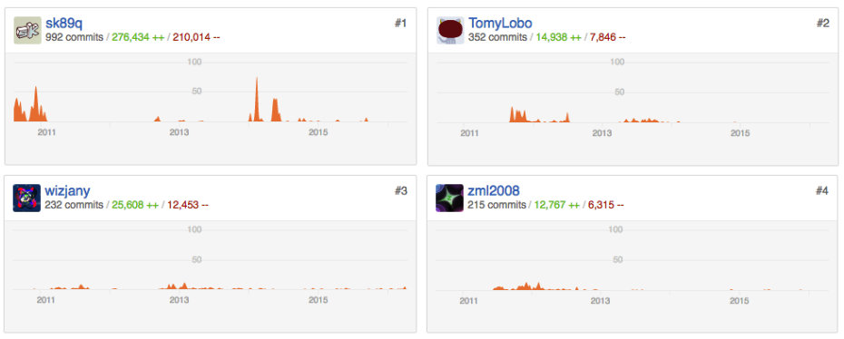

# Stakeholders

WorldEdit is made of a large necessity from the community all around the world running vanilla minecraft or Bukkit/Forge servers.
The project runs on a voluntary base and is featured in a large community of plugins called [Bukkit](https://www.bukkit.org).

It's almost impossible for the community to imagine world or block management without WorldEdit, we can conclude this by the large amount
of users depending on it `13,963,291 downloads on 28/05/2016`.

Figure 1 - An example of a complex architecture very hard to implement manually.

## Developers

WorldEdit has a large base of community contributors. We've grouped the main motors of this project below. The 4 authours below are classified as Authours and have the most commits and activity in the active development process of the software.

Figure 2 - Contributors of the project from the github page

## Users

This stakeholder is made by a group of users that are part of communities like, [Bukkit](http://dev.bukkit.org) and [Forge](http://files.minecraftforge.net/). 
These last two, are the important part that create the bounds between minecraft and plugin loading. Both create the required environment to load mods/plugins into the client.
In our case, WorldEdit makes world management easy, like plug & play. It’s also [part of the Bukkit community](http://dev.bukkit.org/bukkit-plugins/worldedit/), along with lots of other plugins.
WorldEdit, however, implements a clever project structure that molds into being multi-platform using adapters.

The users from communities like Bukkit or Forge, are the important part here, who need this plugin and contribute to it daily, by suggesting new features or helping to fix problems.
